# Online Shoe Store Website

## Overview

This project develops an online shoe store using Django and Python. The platform allows users to browse and purchase products, manage inventory, and handle orders efficiently.

## Key Features

- **Product Management**
  - Display products by category with detailed descriptions.
    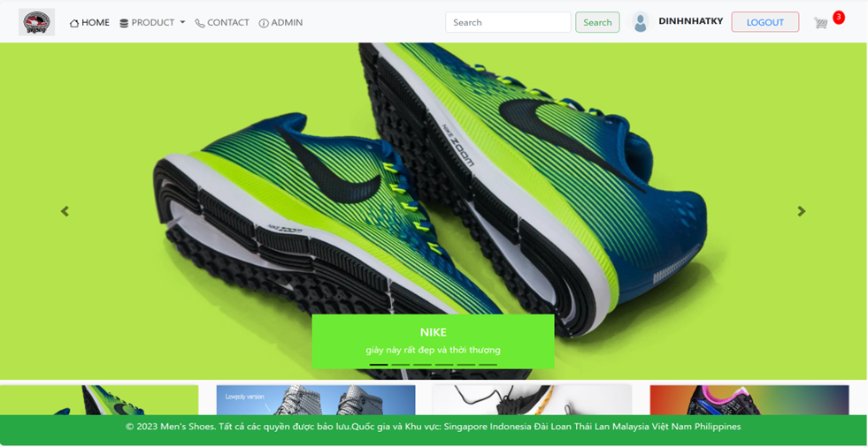
    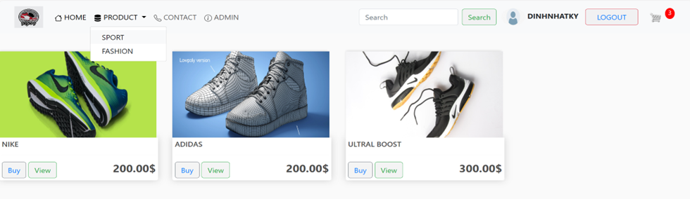
  - Admin interface for adding, updating, and removing products.

    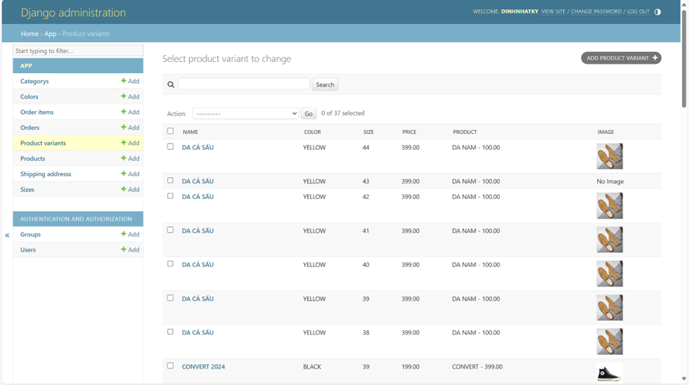
- **Shopping Cart**
  - Add products to the cart, adjust quantities, and remove items.
  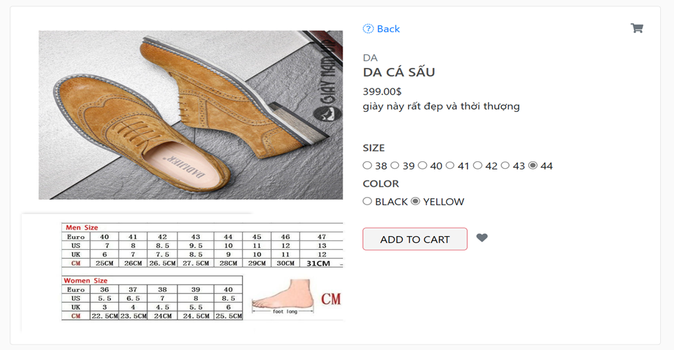
  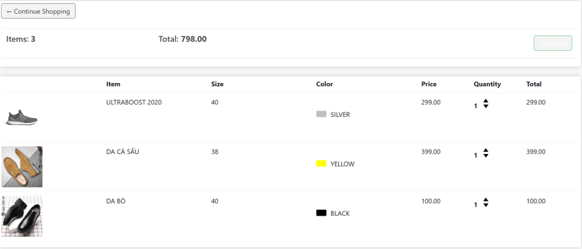
  - Automatic total cost calculation.
  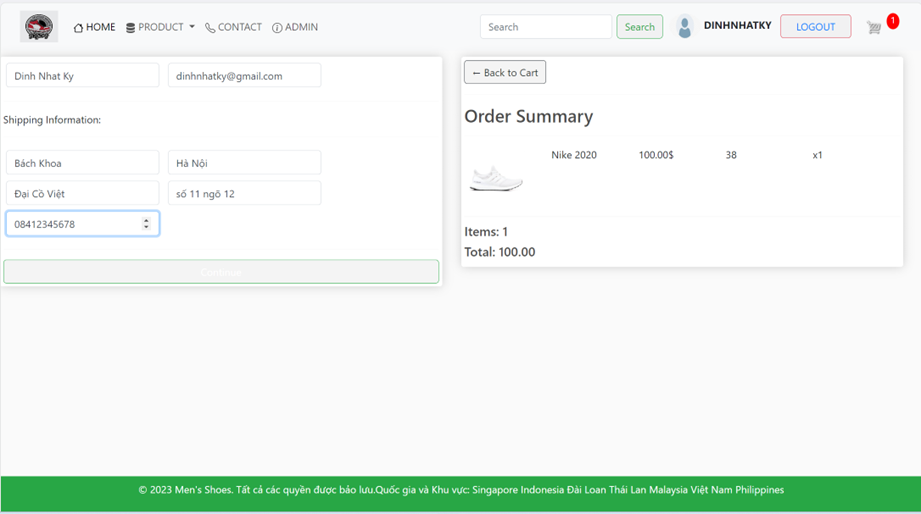

- **Product Search and Filtering**
  - Search by product name.
    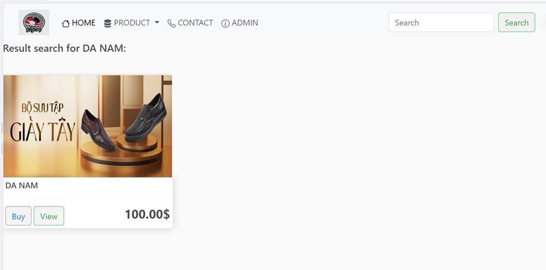
  - Filter products by categories (e.g., Nike, Adidas).

- **User Accounts**
  - Register, log in, and manage orders and delivery addresses.
    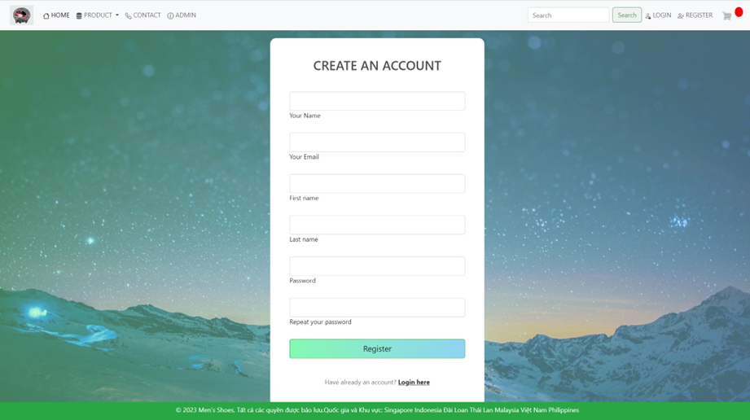
    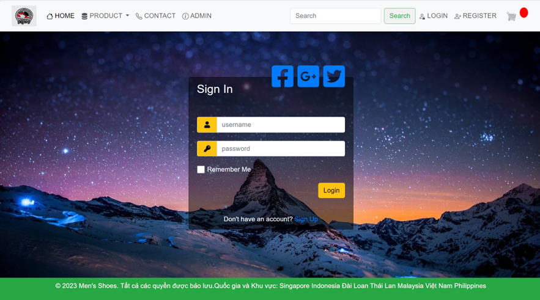

- **Admin Dashboard**
  - Manage product listings, view and process orders, and manage user accounts.
  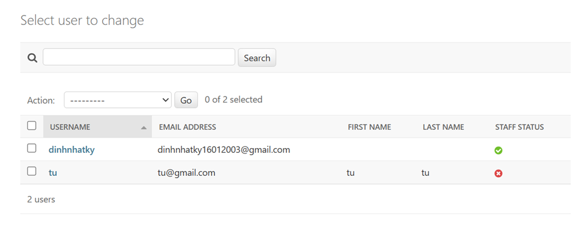
  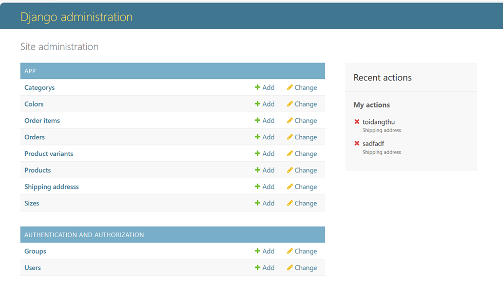

## Technology Stack

- **Django:** For rapid development and secure web application framework.
- **Python:** Programming language used for backend development.
- **HTML/CSS:** For designing the user interface and ensuring a responsive design.

## Technical Justification

- **Django:** Provides a comprehensive set of tools for building robust and scalable web applications, including built-in authentication and admin interface.
- **Python:** Chosen for its ease of use and integration with Django.
- **HTML/CSS:** Essential for creating a user-friendly and visually appealing frontend.

## Functional Requirements

- **Product Listing:** Organized by category with detailed views.
- **Shopping Cart Management:** Allows modification of cart contents and checkout process.
- **Search and Filter:** Enables users to find products quickly.
- **Admin Management:** Facilitates product management, order processing, and user account administration.

## Installation

1. Clone the repository:
   ```bash
   git clone https://github.com/nhatky160103/webbanhang_DinhNhatKy
Navigate to the project directory:

Run migrations:

```bash
python manage.py migrate
```
Start the development server:

```bash
python manage.py runserver
```
Usage
Access the website at http://127.0.0.1:8000/.
Admin interface available at http://127.0.0.1:8000/admin/ with credentials defined in the project.

Contributing
For contributions, please fork the repository and submit a pull request with detailed descriptions of changes.
